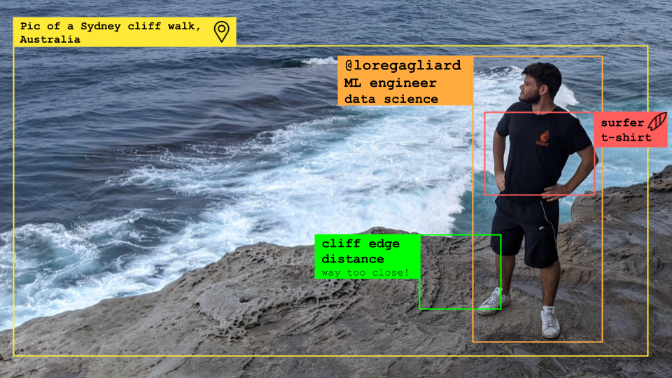

  
  
  
  

<h2 align="center">Hi everyone!</h2>
My name is Lorenzo Gagliardi, I'm from Milan, Italy.
I'm a ML engineer, with mathematical statistics background and 3+ years of experience in learning algorithms and artificial intelligence industry.

I'm passionate about Machine Learning, Artificial Intelligence and technology in general!
Currently specializing in data science field.

Volunteering is basically what keeps my weekends busy, but I also join hackathons from time to time (for fun and glory)!

I love the notion of "open source" itself, I am available to collaborate with any interesting project with the right mission.

To contact me, the most effective way is by email. You can find the address by clicking on the icon above!

<!---
loregagliard/loregagliard is a ✨ special ✨ repository because its `README.md` (this file) appears on your GitHub profile.
You can click the Preview link to take a look at your changes.
--->
